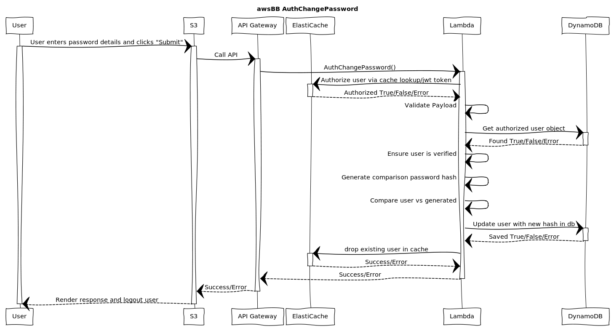

# AuthCreateUser


## WebSequenceDiagrams Code:
[WebSequenceDiagrams](https://www.websequencediagrams.comm)

```
title awsBB AuthChangePassword

participant "User" as u
participant "S3" as s3
participant "API Gateway" as api
participant "ElastiCache" as ec
participant "Lambda" as l
participant "DynamoDB" as db

u->s3: User enters password details and clicks "Submit"
activate u
activate s3
s3->api: Call API
activate api
api->l: AuthChangePassword()
activate l
l->ec: Authorize user via cache lookup/jwt token
activate ec
ec-->l: Authorized True/False/Error
deactivate ec
l->l: Validate Payload
l->db: Get authorized user object
activate db
db-->l: Found True/False/Error
deactivate db
l->l: Ensure user is verified
l->l: Generate comparison password hash
l->l: Compare user vs generated
l->db: Update user with new hash in db
activate db
db-->l: Saved True/False/Error
deactivate db
l->ec: drop existing user in cache
activate ec
ec-->l: Success/Error
deactivate ec
l-->api: Success/Error
deactivate l
api-->s3: Success/Error
deactivate api
s3-->u: Render response and logout user
deactivate u
```
