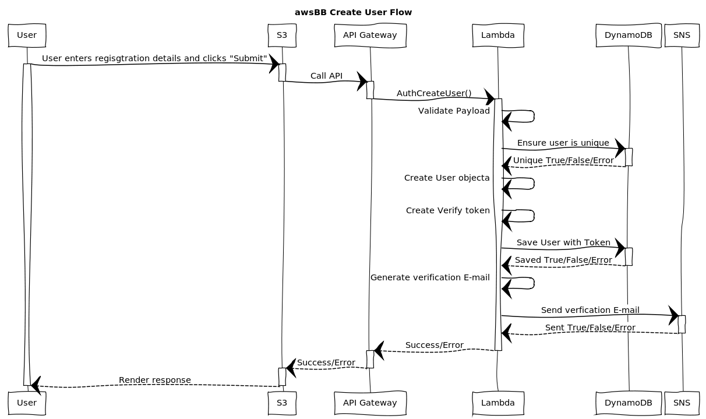

# AuthCreateUser



## WebSequenceDiagrams Code:
[WebSequenceDiagrams](https://www.websequencediagrams.commark)

```
title awsBB Create User Flow

participant "User" as u
participant "S3" as s
participant "API Gateway" as api
participant "Lambda" as l
participant "DynamoDB" as db
participant "SNS" as sns

u->s: User enters regisgtration details and
clicks "Submit"
activate u
activate s
s->api: Call API
activate api
deactivate s
api->l: AuthCreateUser()
deactivate api
activate l
l->l: Validate Payload
l->db: Ensure user is unique
activate db
db-->l: Unique True/False/Error
deactivate db
l->l: Create User objecta
l->l: Create Verify token
l->db: Save User with Token
activate db
db-->l: Saved True/False/Error
deactivate db
l->l: Generate verification E-mail
l->sns: Send verfication E-mail
activate sns
sns-->l: Sent True/False/Error
deactivate sns
l-->api: Success/Error
deactivate l
activate api
api-->s: Success/Error
deactivate api
activate s
s-->u: Render response
deactivate s
deactivate u
```
