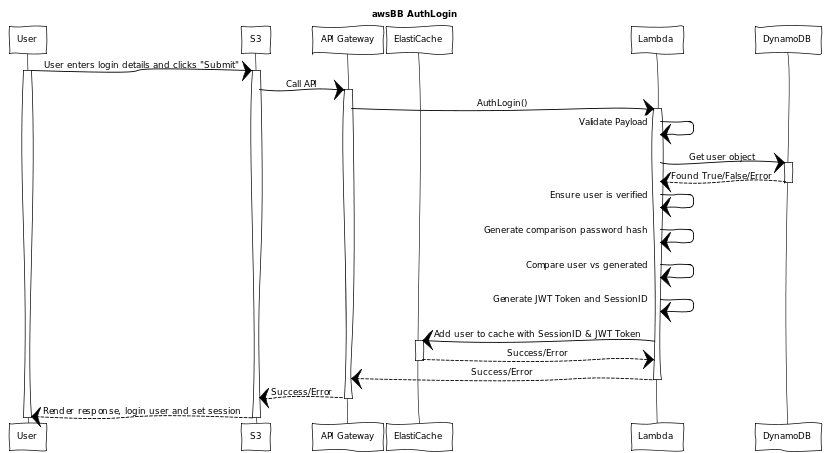

# AuthLogin


## WebSequenceDiagrams Code:
[WebSequenceDiagrams](https://www.websequencediagrams.comm)

```
title awsBB AuthLogin

participant "User" as u
participant "S3" as s3
participant "API Gateway" as api
participant "ElastiCache" as ec
participant "Lambda" as l
participant "DynamoDB" as db

u->s3: User enters login details and clicks "Submit"
activate u
activate s3
s3->api: Call API
activate api
api->l: AuthLogin()
activate l
l->l: Validate Payload
l->db: Get user object
activate db
db-->l: Found True/False/Error
deactivate db
l->l: Ensure user is verified
l->l: Generate comparison password hash
l->l: Compare user vs generated
l->l: Generate JWT Token and SessionID
l->ec: Add user to cache with SessionID & JWT Token
activate ec
ec-->l: Success/Error
deactivate ec
l-->api: Success/Error
deactivate l
api-->s3: Success/Error
deactivate api
s3-->u: Render response, login user and set session
deactivate u
```
