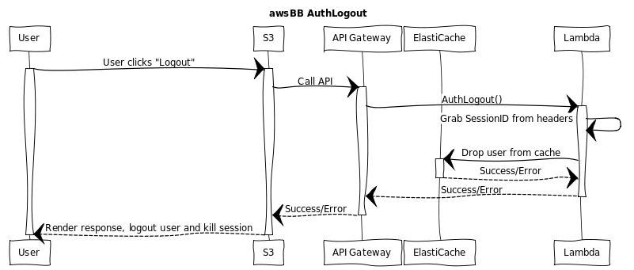

# AuthLogout


## WebSequenceDiagrams Code:
[WebSequenceDiagrams](https://www.websequencediagrams.comm)

```
title awsBB AuthLogout

participant "User" as u
participant "S3" as s3
participant "API Gateway" as api
participant "ElastiCache" as ec
participant "Lambda" as l

u->s3: User clicks "Logout"
activate u
activate s3
s3->api: Call API
activate api
api->l: AuthLogout()
activate l
l->l: Grab SessionID from headers
l->ec: Drop user from cache
activate ec
ec-->l: Success/Error
deactivate ec
l-->api: Success/Error
deactivate l
api-->s3: Success/Error
deactivate api
s3-->u: Render response, logout user and kill session
deactivate u
```
